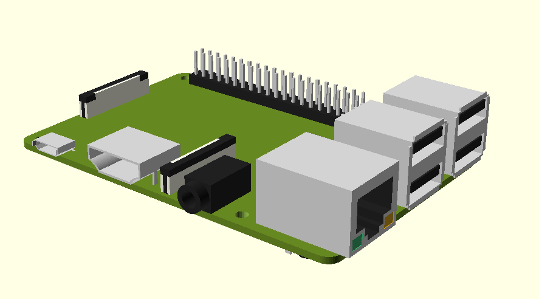
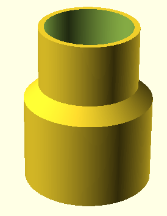
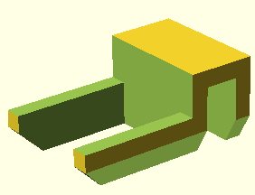
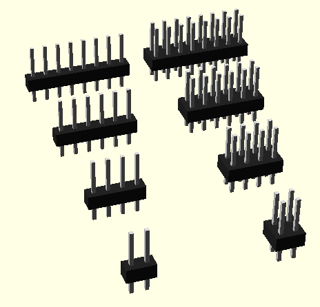

# My openscad models

## Models

### Raspberry PI 3b+

Useful for sanity checking case designs. More info in [model readme](models/raspberry-pi-3b-plus/README.md)

### Hose adapter

For connecting vacuum hose to power tool dust collectors. Diameter parameters refer to inside diaemeter

### Fish tank glass bracket

Supports to hold a piece of glass/perspex above an open fish tank. Currently not parametized

### Pin header (as module)

Included as a module to import and use in other models. [Example usage](models/pin-header-example.scad)

## Scripts

- `print-resolution.scad` - Sets to `$fa` and `$fs` variables suitable for 3d printing
- `transformations.scad`
  - Translation helpers:
    - `translateX(n)`
    - `translateY(n)`
    - `translateZ(n)`
  - Rotation helpers:
    - `rotateX(n)`
    - `rotateY(n)`
    - `rotateZ(n)`

## Usage

Run `git submodule update --init` after cloning

Feel free to fork and PR

My openscad models © 2024 by MacroMan (David Wakelin) is licensed under Creative Commons Attribution-ShareAlike 4.0 International.

To view a copy of this license, visit https://creativecommons.org/licenses/by-sa/4.0/

