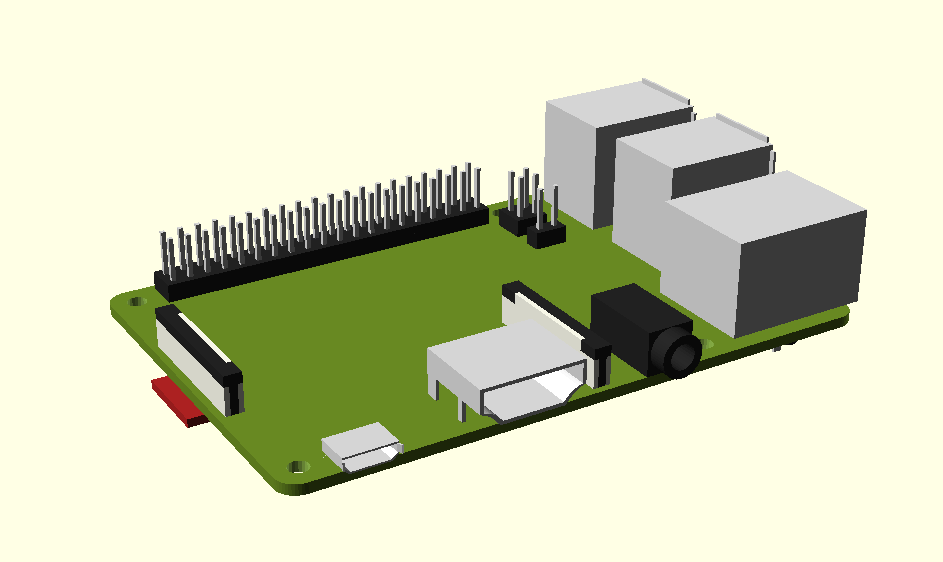
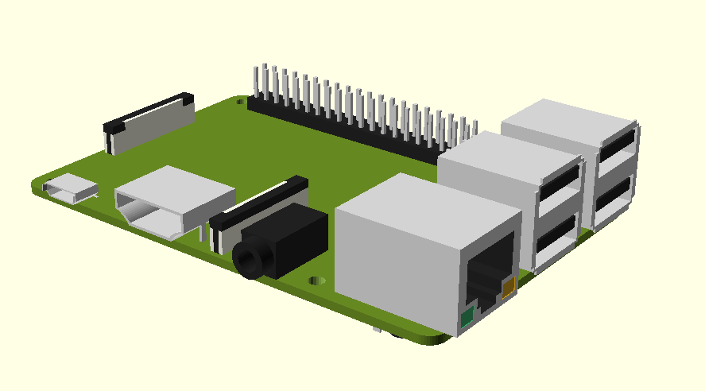
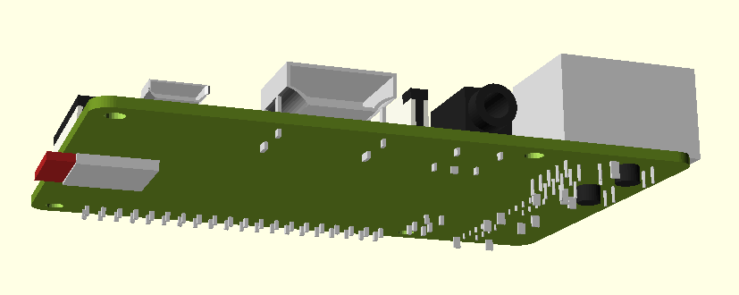

# OpenSCAD model of Raspberry Pi 3 model B+

- Useful for sanity checking case designs
- Positions of components are accurate according to https://datasheets.raspberrypi.com/rpi3/raspberry-pi-3-b-plus-product-brief.pdf
- Actual component shapes may vary as they have been measured manually using vernier calipers
- The corners on the HDMI and micro-USB ports are estimations only